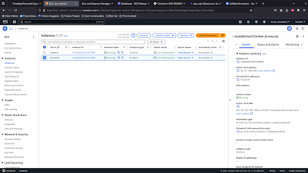
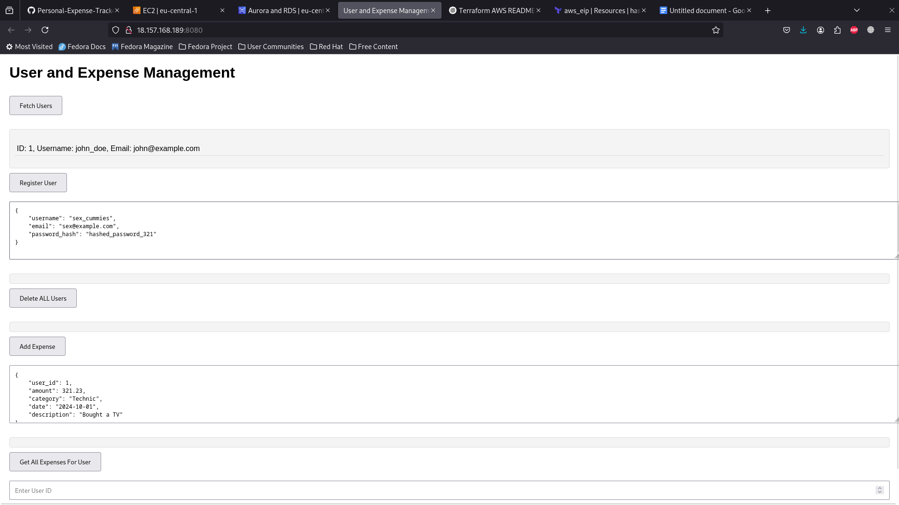
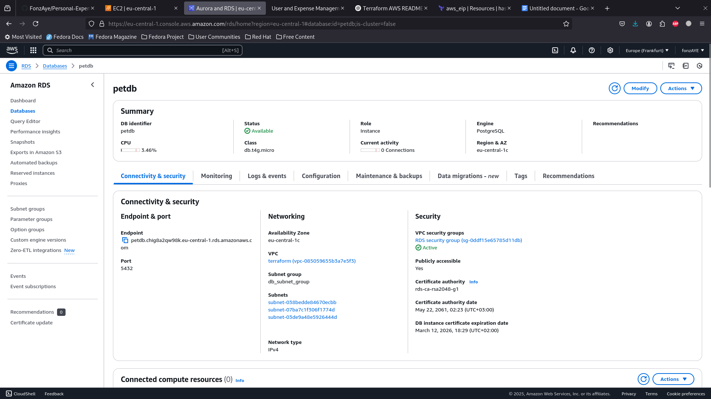

# Personal Expense Tracker - AWS Infrastructure

## Overview
This project provisions the necessary AWS infrastructure for a personal expense tracker using **Terraform**. It deploys a backend API server, a frontend client, and a PostgreSQL database on AWS with a structured and secure networking setup.

## Infrastructure Components

### 1. **EC2 Instances (Server & Client)**
- **Ubuntu AMI**: Deploys the latest Ubuntu AMI.
- **Server Instance**:
  - Configures an API server using a **user-data script**.
- **Client Instance**:
  - Configures a frontend server using a **user-data script**.
- **IAM Role & Policies**:
  - Grants the EC2 instance access to **AWS Secrets Manager**.
  - Uses an **instance profile** for secure access.

### 2. **RDS (Database)**
- **RDS Instance**: Provisions a managed PostgreSQL database.
- **Secrets Manager**: Stores database credentials securely.

### 3. **Networking**
- **VPC**:
  - Enabled with **DNS hostnames** (needed for RDS setup).
- **Subnets**:
  - **Public**: Assigns public IPs to instances.
  - **Private**: Internal resources without public IP.
  - **DB**: Dedicated for RDS, supporting multi-AZ.
- **Route Table**:
  - Configures local routing and Internet Gateway.
- **Security Groups**:
  - **EC2 SG**:
    - Allows **SSH (22), API Server (8080), Frontend (5000)**.
  - **DB SG**:
    - Allows **PostgreSQL (5432)** for EC2 instances and your IP.

---

## Prerequisites
Ensure you have the following installed and configured:

- **Terraform** (latest version) → [Install Terraform](https://developer.hashicorp.com/terraform/tutorials/aws-get-started/install-cli)
- **AWS CLI** (latest version) → [Install AWS CLI](https://aws.amazon.com/cli/)
- **IAM Permissions**:
  - Ability to create EC2, RDS, VPC, and IAM resources.
  - Access to **Secrets Manager**.

---

## Deployment Instructions
### 1. Clone the Repository
```sh
 git clone https://github.com/FonzAye/Personal-Expense-Tracker.git
 cd Personal-Expense-Tracker
```
### 2. Initialize Terraform
```sh
 terraform init
```
### 3. Review & Apply Terraform Configuration
```sh
 terraform plan
 terraform apply -auto-approve
```
---

## Project Structure

```
📂 Personal-Expense-Tracker
├── client
│   ├── index.html
│   ├── package.json
├── README.md
├── server
│   ├── app.js
│   ├── config
│   │   └── db.js
│   ├── controllers
│   │   ├── expenseController.js
│   │   └── userController.js
│   ├── package.json
│   ├── routes
│   │   ├── expenseRoutes.js
│   │   └── userRoutes.js
│   └── server.js
└── terraform
    ├── modules
    │   ├── compute
    │   │   ├── main.tf
    │   │   └── variables.tf
    │   ├── database
    │   │   ├── main.tf
    │   │   ├── outputs.tf
    │   │   └── variables.tf
    │   └── network
    │       ├── main.tf
    │       ├── outputs.tf
    │       └── variables.tf
    └── web app
        ├── files
        │   ├── create-client.tpl
        │   └── create-server.sh
        └── main.tf
```

---

## Preview

### EC2 Instances


### Web Application


### RDS Instance


## Contributing

Contributions are welcome! Feel free to submit a PR or open an issue.
